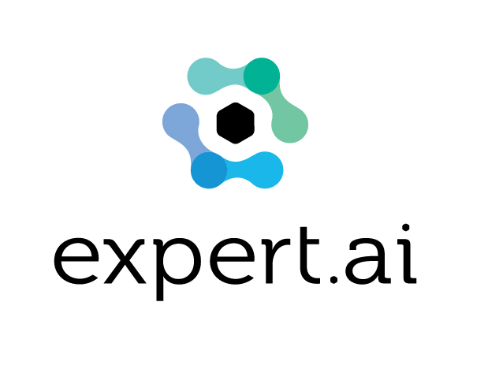

# TubaSite

link : https://tubasite.herokuapp.com
author @Issac To

## 1. 🎉 Introduction

Tubasite is a rating and reviewing website solely for the brass instrument tuba. 

Apologies : Heroku free tier deployment may take several seconds to run.

```
npm run dev  
```

## 2. 📌 Structure

<a href="https://nodejs.org" target="_blank"> 
</a>
<a href="https://reactjs.org/" target="_blank"> 
</a>
<a href="https://expressjs.com" target="_blank">  </a>
<a href="https://www.mongodb.com/" target="_blank"> 
</a> 
<a href="https://www.python.org" target="_blank">  </a>
<a href="https://aws.amazon.com" target="_blank">  </a>
<a href="https://www.expert.ai" target="_blank">  </a>

## A. 💎 Full Stack Framework (MERN)
* Mongodb
* Express
* React
* Node

## B. 🚀 NLP Plugin
* Express.ai (Python)
* Amazon Lambda
* Amazon Gateway


## 3. 📝 Implementation


## 4. ⚠️ Problem


## 5. ↗️ Reference


