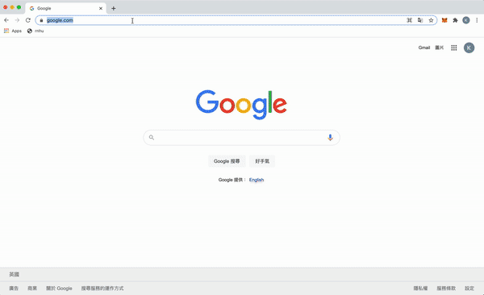
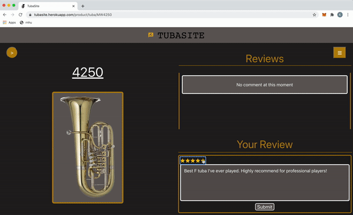
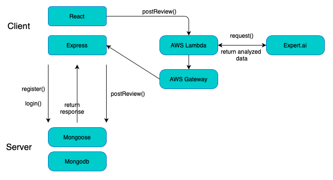

# TubaSite

| Login+Comment        | Review + Ranking           | 
| ------------- |:-------------:| 
|       |  |


Link: https://tubasite.herokuapp.com 
<br/>About: Multi-Rating
<br/>Author: Issac To

## 1. 🎉 Introduction

Tubasite is a rating and reviewing website solely for tuba's models.  The website is unique in that natural language processing technologies are used, which includes sentiment analysis and key elements identification. As such, not only could users look at the highest rated tuba model, but also they could look at the highest ranked tuba models based on sentiment analysis. A huge shout-out to expert.ai for providing such awesome technology.

### High Level Graph




## 2.  📝 Implementation

1. Add a file key.js inside the config folder to link your mongodb database
``` javascript
module.exports = {
    mongoURI: YourMongodbLink,
    useUnifiedTopology: true ,
    secretOrKey: "secret"
};
```
2. Set up the Expert.Ai file and put it on AWS Lambda and Gateway. References are on the bottom

3. Install and run the program
```javascript 
npm install
cd client
npm install
cd ..
npm run dev  
```

4. Go to http://localhost:3000

## 3. 📌 Structure


### A. 💎 Full Stack Framework (MERN)
* Mongodb
* Express
* React
* Node

### B. 🚀 NLP Plugin
* Express.ai (Python)
* Amazon Lambda
* Amazon Gateway


## 4.  ⚠️ Problem
1. Due to the limitations of Mongodb free tier scheme, tubasite doesn't allow clients to edit, comment and like their comments. 
2. Due to the limitations of Heroku free tier deployment scheme, it may take several seconds to load the heroku website

## 5.  ↗️ Reference
1. https://github.com/therealexpertai/nlapi-python
2. https://blog.bitsrc.io/build-a-login-auth-app-with-mern-stack-part-1-c405048e3669
3. https://manivannan-ai.medium.com/import-custom-python-packages-on-aws-lambda-function-5fbac36b40f8


